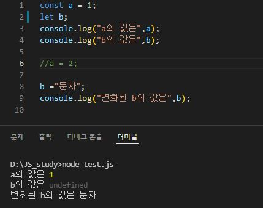

# JavaScript 변수선언
- const, let, var가 있다
- var : 자바스크립트 변수선언에 이제 안쓰는것
- var는 변수 중복선언가능, 재할당가능, 선언만가능
- 이런 문제로 이상한곳에 이상한 데이터가 할당이되고 오류가 발생하게됨
- 이 문제로 이제 사용하지 않음

## const
- 변수의 중복선언 불가능
- 변수의 재할당 불가능
- 변수를 선언과 초기화 동시진행 해야함(재할당이 불가능해서)

## let
- 변수의 중복선언 불가능
- 변수의 재할당 가능
- 변수를 선언만 가능(재할당이 가능하기 때문)

## const & let 예제 그림

### const & let 선언하기

### const & let 재할당

# ajax(비동기 통신)
- 페이지가 리로드 되는것 없이 부분적으로 데이터만 요청하여 바꾸는것

## 장점
- 페이지 갱신없이 서버와 비동기 통신
- 화면이 새로 로딩이 아니기에 웹페이지 속도향상
- 별도의 플러그인이 필요치 않음
